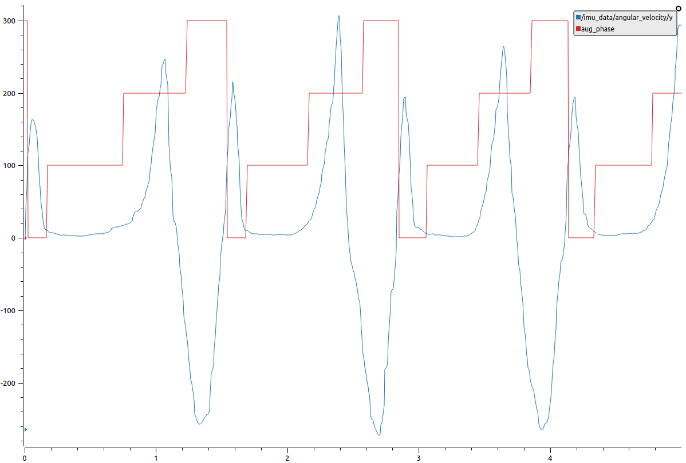

# Online Gait Phase Detection

The AGoRA exoskeleton utilizes both an online threshold-based algorithm (written in C++) and a Hidden Markov Model (HMM) based partitioning method with an intra-subject training approach (written in Python) to accurately detect four gait phases: Heel Strike, Flat Foot, Heel-Off, Toe-Off. These modules run on ROS (Robot Operative System) for its modular integration with the system control of this wearable device in the package [agora_exo](https://github.com/luiszlp/agora_exo) (Private access).

## Threshold-based algorithm

The main node may be found in src/nodes/threshold_detection_node.cpp which implements the following utilities: `src/util/feature_extractor.cpp` and `src/util/gait_cycle_classifier.cpp`. 

## HMM-based algorithm

This segmentation method makes use of the pomegranate library to create a Gaussian HMM trained by means of the Baum-Welch algorithm and validated by using the Viterbi algorithm, which finds the most-likely sequence based on an already-trained model.

In this sense, this classification method implements two training approaches in order to assess intra/inter variability within both healthy and pathological subjects. As part of an approved experimental protocol, a study was conducted involving 18 participants (9 healthy, 9 pathological) performed three walking trials on a treadmill at a self-selected speed (Patient summary found in `log/patient_summary.txt`). On the one hand, a subject-specific technique trains the model with data drawn from the first two walking trials and test its performance with the remaining one by comparing the outcomes with an FSR-based reference system (`scripts/util/HMM_sclassifier_intra-sub_train.py`). On the other hand, an intra-subject approach uses data from healthy subjects to train the model and test with the last walking trial corresponding to the assessed subject (`scripts/util/HMM_sclassifier_intra-sub_train.py`).

## Prerequisites

Since the algorithms comprised within this package require a high processing power, we recommend you to install the dependencies on an external computer with enough capabilities. Knowing that, the HMM-based detection method utilizes the Pomegranate library to run the adaptative model in Python. To install this dependency, type the following command line into a terminal:

```
pip install pomegranate
```

If you still want to install this dependency on a Raspberry Pi, even though its processing limitations, you have to clone the developer repository:

```
git clone https://github.com/jmschrei/pomegranate
```

Then, look at the installation requirement needed to compile the pomegranate library:

```
cat requirements.txt
```

and consistently install these dependencies with the specified versions by running something like:

```
pip install '[package_name] <>== 0.0'
```

One additional depedency that you may have to install even though it is not included in the requirements file is `cython`. Once all dependencies are installed, run the following line command:

```
pip install git+https://github.com/jmschrei/pomegranate.git
```

And reboot the board by running:

```
sudo reboot
```

Now, the pomegranate library should be working on the Rpi.

## Usage for online implementation

In order to tailor an HMM for each subject, a training procedure appears to be mandatory. To this end, some inertial data needs to be collected prior to the actual validation. To do so, the subject's name has to be first setup in the configuration file (open `config/online_detection.yaml` and change the `patient` entry as follows: `<firstname_lastname>`), and then data drawn from an inertial sensor (BNO055, Bosch) can be acquired by running the following node (after having run `roscore`):

```
rosrun hmm_gait_phase_classifier imu_data_acquisition.py
```

Or you can rather simulate some data already taken during the study conducted for the offline validation of both detection algorithms by running the following node:

```
rosrun hmm_gait_phase_classifier publish_imu_data.py <patient_name>
```

Where the patient name can correspond to whatever subject is included in `log/patient_summary.txt`. The associated files `log/mat_files/<patient_name>_proc_data<n>` have to be inside the `simulation` folder for this command to work. This data being transferred via the topic `imu_data` can be then exported by running the following launch file:

```
roslaunch hmm_gait_phase_classifier imu_data_exporter.launch
```

A `csv` file is then recorded and save into the route `log/IMU_data/<patient_name>_<date_time>`. The *online* approach of the HMM-based gait phase detection method does not make use of the FSR-based reference system to initialize the multivariate Gaussian distributions that describe each hidden state (i.e. the gait phase detected). However, since the initial parameters of these distributions significantly affects the convergence of the training procedure, reference labels related to the collected training data remain to be necessary. Thus, you need to manually remove the date-time so that a labeling process by means of the threshold-based detection algorithm can be performed. Once the `csv` file has been modified, label the collected data by running the following node:

```
rosrun hmm_gait_phase_classifier offline_threshold_detection_node
```

By running this command, the file `log/IMU_data/<patient_name>_labels.csv` should have been created containing the corresponding reference labels. Now that we have some references to initialize the HMM, you may run the main node of online gait phase detection:

```
roslaunch hmm_gait_phase_classifier online_gait_phase_det.launch
```

The first use of this node with a new subject may take a minute since it searches for the reference labels, initilizes the gaussian distribution of each state, trains the model using the Baum-Welch algorithm, and finally saves the optimized parameters of both the distributions and the model itself in the route `log/HMM_models/`. For further uses with the same subject, it is only necessary to run this last launch file, since the subject-specific model, which was previously trained, is then loaded. For the case of healthy subjects, the training procedure may be skipped by using generic models stored in the same directory (`log/HMM_models/healthy<n>`).

Once the online detection nodes prompts up a warning message saying `Spinning...`, it means that the model is ready to receive inertial data (either captured in real-time or simulated from data already collected) via the topic `imu_data` and to segment the gait cycle into the gait events in the following manner: 0 means heel-strike, 1 means flat foot, 2 means heel-off, and 3 means toe-off. 

For the visualization of the classifier performance, we recommend you to use the tool `PlotJuggler`:

```
rosrun plotjuggler PlotJuggler
```

Now, load the layout file `gait_det.xml` and evaluate the gait phase classification by comparing it with the following image:



## Contributing
Pull requests are welcome. For major changes, please open an issue first to discuss what you would like to change.

Please make sure to update tests as appropriate.
